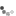

# jquery.itneverends

jQuery Infinite Scrolling with JSON Data Feed

## Getting Started

Download the [production version][min] or the [development version][max].

[min]: https://raw.github.com/osahner/jquery-itneverends/master/dist/jquery.itneverends.min.js
[max]: https://raw.github.com/osahner/jquery-itneverends/master/dist/jquery.itneverends.js

In your web page:

```html
<script src="jquery.js"></script>
<script src="lodash.js"></script>
<script src="jquery.itneverends.min.js"></script>

<script id="itneverendsTemplate" type="text/x-template">
  {{ _.forEach(rows, function(row) { }}
    <li class="list-item">{{- row.name }}</li>
  {{ }); }}
</script>

<ul id="mylist">
</ul>

<script>
jQuery(function($) {
  var reqParams = {
    pageNumber: 1,
    pageSize: 100,
    sortName: 'name',
    sortOrder: 'asc'
  };
  $('#mylist').itneverends({
    url: '/some/json/datafeed',
    height: '400px',
    listTemplate: $('#itneverendsTemplate').html(),
    reqParamsFunc: function (params) {
      return {
        pageNumber: params.pageNumber ? ++params.pageNumber : reqParams.pageNumber,
        pageSize: params.pageSize || reqParams.pageSize,
        sortName: params.sortName || reqParams.sortName,
        sortOrder: params.sortOrder || reqParams.sortOrder
      };
    },
    hasMoreFunc: function (data, params) {
      return (data && params.pageNumber * params.pageSize < data.total);
    }
  });
});
</script>

```

## A more complex [Example App](http://jquery-itneverends.herokuapp.com/).

The [HTML](https://github.com/osahner/jquery-itneverends/blob/master/public/index.html)

```html
<div class="list-group" id="myList"></div>
<div class="well panel-info" id="info">&nbsp;</div>
<button class="btn btn-primary" id="reset">Reset</button>
<button class="btn btn-success" id="randomizeData">Randomize Data</button>
<button class="btn btn-info" id="toggleTemplate">Toggle Template</button>

<script id="itneverendsTemplate" type="text/x-template">
  {{ _.forEach(rows, function(row) { }}
    <a class="list-group-item ">{{= row.idx }}.) {{- row.name }} <span class="glyphicon glyphicon-chevron-right pull-right"></span></a>
  {{ }); }}
</script>
<script id="itneverendsTemplate2" type="text/x-template">
  {{ _.forEach(rows, function(row) { }}
    <a class="list-group-item ">{{- row.name }} <span class="badge">{{= Math.ceil(Math.random() * 10) }}</span></a>
  {{ }); }}
</script>

<script>
  $(function () {
    "use strict";
    var $myList = $('#myList'),
    $info = $('#info'),
    _infoTpl = _.template('Loaded records from {{= from }} to {{= to }} out of {{= total }}.'),
    reqParams = {
      pageNumber: 1,
      pageSize: 20,
      sortName: 'name',
      sortOrder: 'asc'
    },
    options = {
      loadOnInit: true,
      height: '200px',
      url: 'data',
      listTemplate: $('#itneverendsTemplate').html(),
      reqParamsFunc: function (params) {
        return {
          pageNumber: params.pageNumber ? ++params.pageNumber : reqParams.pageNumber,
          pageSize: params.pageSize || reqParams.pageSize,
          sortName: params.sortName || reqParams.sortName,
          sortOrder: params.sortOrder || reqParams.sortOrder
        };
      },
      hasMoreFunc: function (data, params) {
        data.pageSize = +data.pageSize;
        data.pageNumber = +data.pageNumber;
        return (data && ((data.pageNumber - 1) * data.pageSize + data.pageSize) < data.total);
      },
      loadingDoneFunc: function(data) {
        if (typeof data === 'object') {
          data.pageSize = +data.pageSize;
          data.pageNumber = +data.pageNumber;
          data.from = (data.pageNumber - 1) * data.pageSize + 1;
          data.to =  (data.pageNumber - 1) * data.pageSize + data.pageSize;
          if (data.to > data.total) data.to = data.total;
          $info.html(_infoTpl(data));
        } else {
          $info.html('Error: ' + data);
        }
      }
    };

    $myList.itneverends(options);

    $('#reset').on('click', function () {
      $myList.itneverends('options', options);
    });

    $('#randomizeData').on('click', function () {
      $.ajax({
        url: 'randomize'
      }).done(function () {
        $myList.itneverends('reset');
      });
    });

    $('#toggleTemplate').on('click', function () {
      $myList.itneverends('options', {listTemplate: $('#itneverendsTemplate2').html()});
    });
  });
</script>

```

Serverside [JSON datafeed](https://github.com/osahner/jquery-itneverends/blob/master/index.js).

```javascript
{
  "pageNumber": 2,
  "pageSize": 20,
  "rows": [
    {
      "idx": 21,
      "name": "Justina Quitzon",
      "email": "Emely_Russel@heaven.biz"
    },
    {
      "idx": 22,
      "name": "Guillermo Jacobs",
      "email": "Candida@dora.me"
    },
    ...
  ],
  "sortName": "name",
  "sortOrder": "asc",
  "total": 53
}
```

## Documentation

Options

 option | type | required | default | description 
---|---|---|---|---
 url | string | true | null | _(Coming soon)_ |
 distance | integer | false | 15 | _(Coming soon)_ |
 throttleDelay | integer | false | 200 | _(Coming soon)_ |
 loadOnInit | boolean | false | true | _(Coming soon)_ |
 height | string/integer | false | 'auto' | _(Coming soon)_ |
 listTemplate | string | false | ```html
{{ _.forEach(rows, function(row) { }}
<li class="list-item">{{- row.name }}</li>
{{ }); }}
``` | _(Coming soon)_ |
 loadingTemplate | string | false | ```html
 <div class="loading"></li>
 ``` | _(Coming soon)_ |
 hasMoreFunc | function | false | ```javascript
function (data) { return false;}
``` | _(Coming soon)_ |
 reqParamsFunc | function | false | ```javascript
function (params) { return {}; }
``` | _(Coming soon)_ |
 loadingDoneFunc | function | false | ```javascript
function (data) {}
``` | _(Coming soon)_ |


## Release History
_(Coming soon)_
